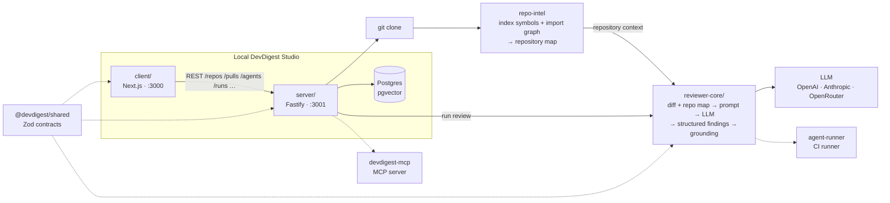

# DevDigest — AI Agentic Engineering Capstone

**DevDigest** is a local-first AI engineering platform for understanding repositories, reviewing pull requests, identifying change risk, and providing grounded engineering insights.

This repository is my **AI Agentic Engineering capstone project**. It started from a course-provided starter repository and was progressively extended throughout the program with repository intelligence, agentic workflows, MCP integration, evaluation tooling, CI automation, multi-agent review, and engineering-quality safeguards.

> **Project context:** personal / educational capstone project demonstrating AI-assisted and agentic software engineering practices. It is not presented as commercial production experience.

---

## What DevDigest does

DevDigest explores how AI agents can support software engineers across the development lifecycle rather than simply generating code.

The platform combines repository analysis, structured context, AI-assisted reasoning, and deterministic safeguards to support:

- Pull request review
- Repository intelligence
- Import and dependency analysis
- Intent and risk analysis
- Smart Diff
- Blast Radius analysis
- Project Context and onboarding
- Multi-agent review
- Agent skills and reusable workflows
- AI output evaluation
- CI review automation
- Agent performance analysis

The core principle is:

> **Give agents structured, relevant engineering context and explicit quality boundaries instead of relying on a generic prompt and raw code diff.**

---

## Architecture



### Review flow

The end-to-end review flow is:

**add a repository → index repository → import PR → analyze diff → assemble repository-aware context → run AI review → ground findings → persist structured results**

The `repo-intel` indexer builds a repository map containing symbols and import relationships. That information becomes additional context for the review engine rather than relying only on the PR diff.

The review pipeline then:

1. Loads the relevant pull request and repository context.
2. Builds a structured review prompt.
3. Calls the configured LLM.
4. Validates the resulting findings.
5. Applies the grounding gate to remove unsupported findings or invalid line references.
6. Persists structured findings, severity, and review scores.

Local application services run on the developer machine. External calls are limited to services required by the workflow, such as GitHub and the configured LLM provider.

---

## Repository structure

This is a multi-package repository rather than a pnpm workspace. Each package has its own `package.json` and lockfile, while shared code is connected through TypeScript path aliases.

| Folder                      | Package                    | Purpose                                                 |   Port |
| --------------------------- | -------------------------- | ------------------------------------------------------- | -----: |
| `server/`                   | `@devdigest/api`           | Fastify API + Drizzle/Postgres (`pgvector`)             | `3001` |
| `client/`                   | `@devdigest/web`           | Next.js web application / studio                        | `3000` |
| `reviewer-core/`            | `@devdigest/reviewer-core` | Review engine: diff → context → prompt → LLM → findings |      — |
| `e2e/`                      | `@devdigest/e2e`           | Deterministic browser end-to-end tests                  |      — |
| `server/src/vendor/shared/` | `@devdigest/shared`        | Shared Zod contracts                                    |      — |
| `mcp-server/`               | `devdigest-mcp`            | MCP server exposing DevDigest capabilities              |      — |
| `agent-runner/`             | —                          | CI-oriented review runner                               |      — |

`repo-intel`, the repository indexer powering the **Indexed** state and repository-aware review context, lives inside:

```text
server/src/modules/repo-intel
```

---

## Key engineering capabilities

### Repository intelligence

DevDigest builds structured knowledge about a repository, including:

- repository structure
- symbols
- import relationships
- dependency information
- affected areas of the codebase
- project-level context

This allows AI workflows to reason about changes using more than the current diff.

### Grounded AI review

A major focus of the project is reducing unsupported AI output.

The review pipeline includes mechanisms such as:

- `groundFindings`
- `wrapUntrusted`
- structured finding contracts
- deterministic verdict calculation
- validation of AI-generated findings
- repository-aware context

The grounding layer helps prevent hallucinated findings and invalid source references from becoming trusted review results.

### Agentic workflows

The project uses specialized agents and reusable skills for different engineering tasks, including:

- repository exploration
- project context discovery
- code review
- intent analysis
- risk analysis
- blast-radius analysis
- structured evaluation
- multi-agent review

The goal is to separate responsibilities and give each workflow the context and tools it needs.

### Skills and project context

DevDigest includes reusable skills and project-level context generation so that agents can work with conventions and repository-specific information rather than starting from zero on every task.

### Smart Diff and intent analysis

The review workflow includes additional context layers that help distinguish:

- what changed
- why the change appears to have been made
- what areas may be affected
- where engineering risk may exist

### Blast Radius

The Blast Radius workflow uses repository intelligence to identify areas potentially affected by a change.

This makes dependency and impact analysis part of the AI-assisted engineering workflow rather than an isolated code-review feature.

### Evaluation pipeline

The project includes an evaluation system for measuring agent behaviour and review quality.

Evaluation workflows cover areas such as:

- review quality
- grounding behaviour
- deterministic quality gates
- structured agent output
- regression detection

This reflects an important principle of AI-assisted engineering:

> **An agent producing an answer is not itself evidence that the answer is correct.**

### Multi-agent review

The project explores combining multiple specialized review agents and aggregating their outputs into a structured review workflow.

This includes support for:

- multiple agents
- run traces
- agent-level results
- review aggregation
- agent performance analysis

### MCP integration

The repository includes a dedicated MCP server that exposes DevDigest functionality to AI clients through the **Model Context Protocol**.

The MCP integration allows repository and review capabilities to become available as tools within an agentic development workflow.

### CI automation

The project includes an `agent-runner` designed to package review functionality for execution in CI workflows.

This extends the system beyond a local AI experiment into an automated engineering workflow that can be executed against a target repository.

---

## What was built across the capstone

The implementation evolved through a sequence of engineering capabilities:

| Area                   | Capability                                      |
| ---------------------- | ----------------------------------------------- |
| Review UX              | Run cost badge, severity filtering              |
| Agent skills           | Product skills and conventions extraction       |
| Review intelligence    | Intent layer and Smart Diff                     |
| Repository analysis    | Blast Radius based on `repo-intel`              |
| MCP                    | `devdigest-mcp` server                          |
| Project context        | Context folder, onboarding generation, PR Brief |
| Evaluation             | Eval pipeline and deterministic quality gates   |
| Security / correctness | Secret and Phantom gates                        |
| Planning               | Plan Verifier                                   |
| CI                     | Export to CI                                    |
| Agent architecture     | Multi-agent review                              |
| Observability          | Run Trace / Live Log                            |
| Memory                 | Persistent agent memory                         |
| Analytics              | Per-agent statistics                            |
| Extensibility          | Plugin export / import                          |
| Operations             | Agent performance dashboard                     |
| Reporting              | Weekly digest                                   |

---

## What works on day one

The project supports an end-to-end local workflow:

- **Local launch** — start Postgres, API, and web application.
- **Repository import** — provide a Git repository URL and index it.
- **Pull request import** — import PR metadata, commits, diff, body, and linked issue information.
- **Diff viewer** — inspect changes through the web UI.
- **Agents** — use built-in reviewers and create custom review agents.
- **Review execution** — run AI-assisted reviews using repository context.
- **Grounding** — validate generated findings against actual source changes.
- **Evaluation** — measure and validate agent behaviour.
- **CI** — export review functionality for automated execution.

---

## Technology

### Frontend

- Next.js
- React
- TypeScript

### Backend

- Fastify
- TypeScript
- Drizzle ORM
- PostgreSQL
- pgvector

### AI / Agentic Engineering

- LLM-based review workflows
- OpenAI
- Anthropic
- OpenRouter
- MCP (Model Context Protocol)
- Agent skills
- Multi-agent workflows
- Evaluation pipelines
- Structured AI output validation

### Engineering infrastructure

- Zod contracts
- Repository indexing
- Import-graph analysis
- Automated tests
- GitHub Actions
- CI automation
- Deterministic quality gates

---

## Why this project matters

The central engineering question behind DevDigest is:

> **How can AI agents become reliable engineering collaborators rather than opaque code generators?**

That requires solving problems beyond prompting:

- providing the right repository context
- separating trusted and untrusted information
- constraining agent behaviour
- validating structured output
- grounding findings in real source changes
- measuring quality
- detecting regressions
- making workflows repeatable
- integrating agents into developer tooling and CI

DevDigest is a practical implementation exploring those ideas.

---

## Prerequisites

- **Node.js** ≥ 22
- **pnpm** ≥ 10
- **Docker** for PostgreSQL / pgvector

Install pnpm when needed:

```bash
npm install -g pnpm
```

---

## Quick start

The recommended local setup is:

```bash
./scripts/dev.sh
```

The script:

1. starts PostgreSQL using Docker;
2. waits for the database to become healthy;
3. creates `server/.env` and `client/.env` from the provided examples when needed;
4. installs package dependencies when `node_modules` is missing;
5. applies database migrations;
6. seeds demo data;
7. starts the API on `:3001`;
8. starts the web application on `:3000`.

Open:

```text
http://localhost:3000
```

Press **Ctrl-C** to stop the development servers.

PostgreSQL remains running until stopped explicitly:

```bash
docker compose down
```

### Script options

```text
--no-seed
--no-client
--db-only
--help
```

---

## Configuration

API credentials can be configured through `server/.env` or through the application settings flow.

Typical integrations include:

```env
OPENAI_API_KEY=...
ANTHROPIC_API_KEY=...
GITHUB_TOKEN=...
```

Do not commit real credentials to the repository.

---

## Manual setup

The `scripts/dev.sh` helper automates the following steps.

### Start PostgreSQL

```bash
docker compose up -d
```

### Install and start the API

```bash
cd server
pnpm install
pnpm db:migrate
pnpm db:seed
pnpm dev
```

The API runs on:

```text
http://localhost:3001
```

### Install and start the web app

In a separate terminal:

```bash
cd client
pnpm install
pnpm dev
```

The web application runs on:

```text
http://localhost:3000
```

---

## Useful scripts

### `server/`

```text
dev
build
db:migrate
db:seed
db:generate
test
typecheck
```

Server tests can be split between hermetic unit tests and database-backed integration tests.

### `client/`

```text
dev
build
start
test
typecheck
```

Individual packages also contain their own README files with package-specific architecture and development details.

---

## Testing & CI

The project maintains separate test suites and GitHub Actions workflows.

| Suite                       | Workflow                 | Docker |
| --------------------------- | ------------------------ | ------ |
| Client (`vitest` + `jsdom`) | `client.yml`             | No     |
| Server unit tests           | `server-unit.yml`        | No     |
| Server integration tests    | `server-integration.yml` | Yes    |
| Reviewer core               | `reviewer-core.yml`      | No     |
| Web E2E                     | `e2e-web.yml`            | Yes    |

Server tests are separated by filename:

```text
*.it.test.ts
```

are database-backed integration tests, while the remaining tests are designed to run hermetically.

The browser E2E suite uses `agent-browser` and runs against the real application stack without relying on an LLM for deterministic browser flows.

See [`TESTING.md`](TESTING.md) for the detailed testing strategy.

---

## Troubleshooting

### `relation ... does not exist`

The database migrations have not been applied.

Run:

```bash
cd server
pnpm db:migrate
```

The API does not automatically migrate the database on startup.

### Port `5432` already in use

Another PostgreSQL instance is already running.

Stop it or change the host port in:

```text
docker-compose.yml
```

### `vector` type errors

The `pgvector` extension is enabled by the initial database migration.

Make sure migrations are running against the Dockerized PostgreSQL instance:

```bash
cd server
pnpm db:migrate
```

### Reset the local database

To remove the PostgreSQL volume and recreate the environment:

```bash
docker compose down -v
./scripts/dev.sh
```

---

## Package documentation

Deeper technical documentation is available inside the individual packages:

- [`client/README.md`](client/README.md) — UI and route architecture
- [`server/README.md`](server/README.md) — API and backend architecture
- [`reviewer-core/README.md`](reviewer-core/README.md) — review pipeline
- [`e2e/README.md`](e2e/README.md) — browser E2E testing

---

## Project status

**AI Agentic Engineering capstone / portfolio project**

The project represents an evolving engineering experiment rather than a finished commercial product.

The primary focus is on:

- practical AI-assisted software engineering
- agentic workflows
- repository intelligence
- reliable AI output
- evaluation and quality gates
- developer tooling
- CI integration
- engineering architecture

This repository is maintained as a separate portfolio-facing project, while the original course development repository remains available separately as a learning/archive record.
