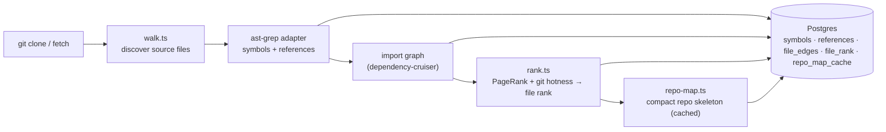

# `repo-intel` — the codebase indexer

`repo-intel` reads a cloned repository **once on clone** (and incrementally on
fetch, keyed by file content hash) and turns it into queryable facts: symbols,
the import graph, a PageRank-based file importance score, and a compact **repo
map** (the project skeleton). On a review it is only **read** — the index is
already computed, so adding context to a prompt costs no analysis at request time.

It works from day 1 (the **Indexed** badge), and other modules build features
_on top_ of its facade rather than re-indexing: Blast Radius
(`modules/blast`), Conventions samples (`modules/conventions`), and the
Onboarding reading-path (`modules/onboarding`) all call `repoIntel.*`. The
phantom-API gate (unresolved-reference detection) is not yet wired to this
facade — see the note on `getUnresolvedReferences` below.

## Pipeline

Full vs incremental indexing lives in `pipeline/{full,incremental}.ts`; an
unindexed or partially-indexed repo degrades gracefully (the facade returns empty
results rather than throwing).

## Facade (`repoIntel.*`)

Everything downstream reads through one facade (`service.ts`) so consumers never
touch the pipeline internals:

- `getRepoMap(repoId)` → the cached repo skeleton (fed into the **review prompt**).
- `getFileRank(repoId, files)` → importance percentile per changed file.
- `getCallerSignatures(repoId, files, limit)` → callers of changed symbols.
- `getBlastRadius(repoId, files)` → impacted symbols / callers (used by `modules/blast`).
- `getUnresolvedReferences(repoId, …)` → phantom-symbol detection — defined,
  not yet called from outside this module.
- `getConventionSamples(repoId)` → top-ranked files for convention extraction
  (used by `modules/conventions`).

`getRepoMap` / `getFileRank` / `getCallerSignatures` are wired into
`modules/reviews/run-executor.ts`, which adds the repo map and a
high-blast-radius note to the review prompt. Toggled by `REPO_INTEL_ENABLED`
(global) and a per-agent `repo_intel` flag. The facade also exposes several
onboarding-oriented methods (`getIndexState`, `getWeightedRankedFiles`,
`getCriticalPaths`, `getFileFacts`, …) consumed by `modules/onboarding` —
not enumerated above; read `service.ts` for the full surface.

## Routes

- `GET /repos/:id/index-state` — index status (drives the **Indexed** badge).
- `POST /repos/:id/resync` — enqueue a re-index.
